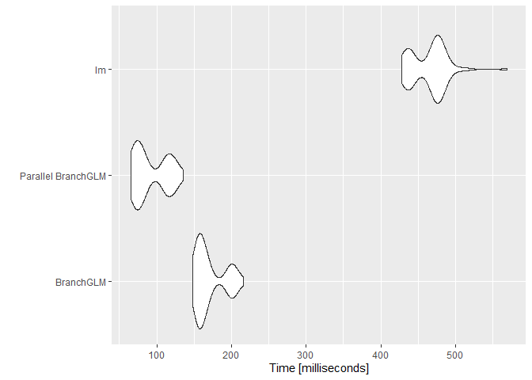
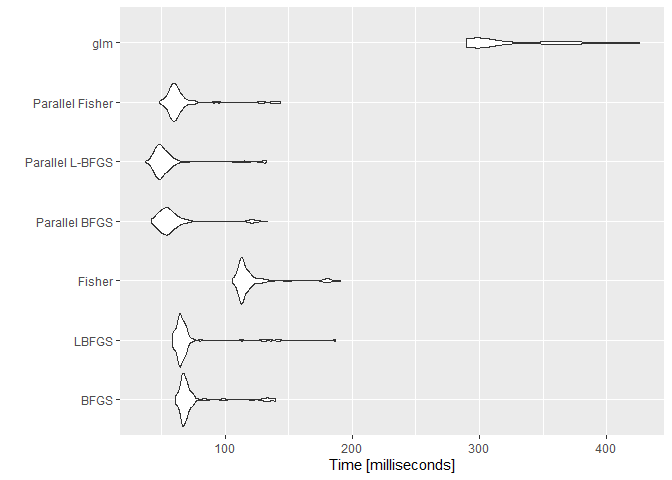

BranchGLM
================

# Overview

**BranchGLM** is a package for fitting glms and performing branch and
bound variable selection for glms.

# How to install

**BranchGLM** can be installed using the `install_github()` function
from the **devtools** package.

``` r
devtools::install_github("JacobSeedorff21/BranchGLM")
```

# Usage

## Fitting glms

### Linear regression

**BranchGLM** can fit large linear regression models very quickly, next
is a comparison of runtimes with the built-in `lm()` function.

``` r
library(BranchGLM)
library(microbenchmark)
library(ggplot2)
set.seed(99601)

NormalSimul <- function(n, d, Bprob = .5){
  
  x <- MASS::mvrnorm(n, mu = rep(1, d), Sigma = diag(.5, nrow = d, ncol = d) + 
                 matrix(.5, ncol = d, nrow = d))
  
  beta <- rnorm(d + 1, mean = 1, sd = 1) 
  
  beta[sample(2:length(beta), floor((length(beta) - 1) * Bprob))] = 0
  
  y <- x %*% beta[-1] + beta[1] + rnorm(n, sd = 3)
  
  df <- cbind(y, x) |> 
    as.data.frame()
  
  df$y <- df$V1
  
  df$V1 <- NULL
  
  df
}
### Big simulation

df <- NormalSimul(10000, 250)

Times <- microbenchmark("BranchGLM" = {BranchGLM(y ~ ., data = df, 
                                                        family = "gaussian",
                                                   link = "identity")},
                        "Parallel BranchGLM" = {BranchGLM(y ~ ., data = df, 
                                                        family = "gaussian",
                                                   link = "identity",
                                                   parallel = TRUE)},
                        "lm" = {lm(y ~ ., data = df)},
                        times = 100)

autoplot(Times, log = FALSE)
```

<!-- -->

### Logistic regression

**BranchGLM** can also fit large logistic regression models very
quickly, next is a comparison of runtimes with the built-in `glm()`
function.

``` r
set.seed(78771)

LogisticSimul <- function(n, d, Bprob = .5, sd = 1){
  
  x <- MASS::mvrnorm(n, mu = rep(1, d), Sigma = diag(.5, nrow = d, ncol = d) + 
                 matrix(.5, ncol = d, nrow = d))
  
  beta <- rnorm(d + 1, mean = 0, sd = sd) 
  
  beta[sample(2:length(beta), floor((length(beta) - 1) * Bprob))] = 0
  
  p <- 1/(1 + exp(-x %*% beta[-1] - beta[1]))
  
  y <- rbinom(n, 1, p)
  
  df <- cbind(y, x) |> 
    as.data.frame()
  df
}

### Big simulation

df <- LogisticSimul(10000, 100)

Times <- microbenchmark("BFGS" = {BranchGLM(y ~ ., data = df, family = "binomial",
                                                   link = "logit", method = "BFGS")}, 
                        "LBFGS" = {BranchGLM(y ~ ., data = df, family = "binomial",
                                                   link = "logit", method = "LBFGS")},
                        "Fisher" = {BranchGLM(y ~ ., data = df, family = "binomial",
                                                   link = "logit", method = "Fisher")},
                        "Parallel BFGS" = {BranchGLM(y ~ ., data = df, family = "binomial",
                                                   link = "logit", method = "BFGS",
                                                   parallel = TRUE)}, 
                        "Parallel L-BFGS" = {BranchGLM(y ~ ., data = df, 
                                                       family = "binomial",
                                                   link = "logit", method = "LBFGS",
                                                   parallel = TRUE)},
                        "Parallel Fisher" = {BranchGLM(y ~ ., data = df, 
                                                        family = "binomial",
                                                   link = "logit", method = "Fisher",
                                                   parallel = TRUE)},
                        "glm" = {glm(y ~ ., data = df, family = "binomial")},
                        times = 100)

autoplot(Times, log = FALSE)
```

<!-- -->

## Variable selection

**BranchGLM** can also perform best subset selection very quickly, here
is a comparison of runtimes with the `bestglm()` function from the
**bestglm** package.

``` r
library(bestglm)
set.seed(33391)

df <- LogisticSimul(1000, 15, .5, sd = .5)

## Times
### Timing branch and bound
system.time(BranchVS <- VariableSelection(y ~ ., data = df, 
                                      family = "binomial", link = "logit",
                  type = "branch and bound", showprogress = FALSE,
                  parallel = FALSE, nthreads = 8, method = "Fisher"))
```

    ##    user  system elapsed 
    ##    0.20    0.00    0.22

``` r
Xy <- cbind(df[,-1], df[,1])

### Timing exhaustive search
system.time(BestVS <- bestglm(Xy, family = binomial(), IC = "AIC", TopModels = 1))
```

    ##    user  system elapsed 
    ##  142.81    0.92  145.14

### Checking results

``` r
## Results
### Checking if both methods give same results
all(names(coef(BranchVS$finalmodel)) == names(coef(BestVS$BestModel)))
```

    ## [1] TRUE

The branch and bound method can be many times faster than an exhaustive
search and is still guaranteed to find the optimal model.

## Parallel computation

Parallel computation can be used to greatly speed up the branch and
bound algorithm, especially when the number of variables is large.

### Non-parallel time

``` r
set.seed(871980)

df <- LogisticSimul(1000, 40, .5, sd = .5)

system.time(BranchVS <- VariableSelection(y ~ ., data = df, 
                                      family = "binomial", link = "logit",
                  type = "branch and bound", showprogress = FALSE,
                  parallel = FALSE, nthreads = 8, method = "Fisher"))
```

    ##    user  system elapsed 
    ##  166.75    0.94  168.99

### Parallel time

``` r
system.time(ParBranchVS <- VariableSelection(y ~ ., data = df, 
                                      family = "binomial", link = "logit",
                  type = "branch and bound", showprogress = FALSE,
                  parallel = TRUE, nthreads = 12, method = "Fisher"))
```

    ##    user  system elapsed 
    ##  242.78    1.50   31.25

### Checking results

``` r
all(names(coef(BranchVS$finalmodel)) == names(coef(ParBranchVS$finalmodel)))
```

    ## [1] TRUE

They both give the same results
