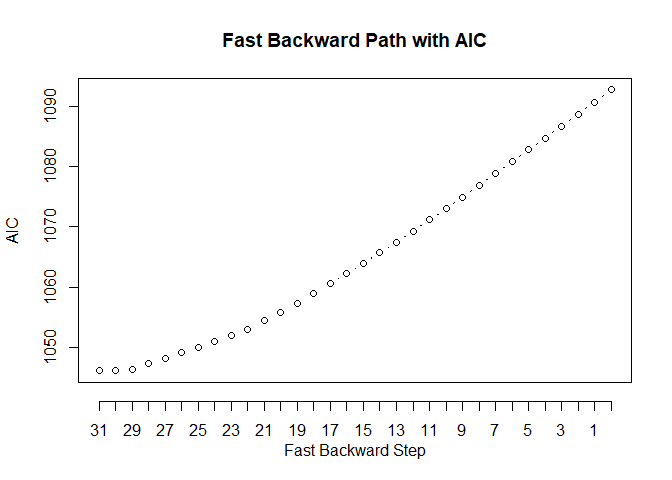
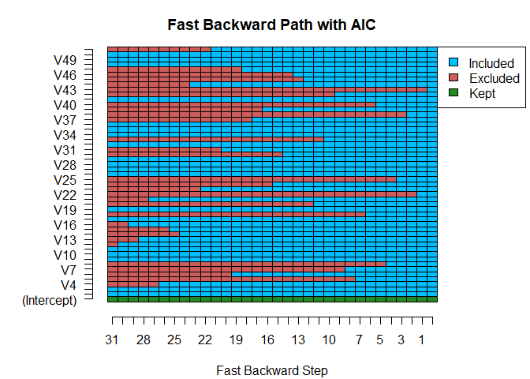

BranchGLM: Efficient Variable Selection for GLMs in R
================

<!-- badges: start -->

[](https://CRAN.R-project.org/package=BranchGLM)
[](https://app.codecov.io/gh/JacobSeedorff21/BranchGLM?branch=master)
<!-- badges: end -->

# Overview

**BranchGLM** is a package for fitting GLMs and performing efficient
variable selection for GLMs.

# How to install

**BranchGLM** can be installed using the `install.packages()` function

``` r
install.packages("BranchGLM")
```

It can also be installed via the `install_github()` function from the
**devtools** package.

``` r
devtools::install_github("JacobSeedorff21/BranchGLM")
```

# Usage

## Fitting GLMs

### Linear regression

**BranchGLM** can fit large linear regression models very quickly, next
is a comparison of runtimes with the built-in `lm()` function. This
comparison is based upon a randomly generated linear regression model
with 10000 observations and 250 covariates.

``` r
# Loading libraries
library(BranchGLM)
library(microbenchmark)
library(ggplot2)

# Setting seed
set.seed(99601)

# Defining function to generate dataset for linear regression
NormalSimul <- function(n, d, Bprob = .5){
  
  x <- MASS::mvrnorm(n, mu = rep(1, d), Sigma = diag(.5, nrow = d, ncol = d) + 
                 matrix(.5, ncol = d, nrow = d))
  
  beta <- rnorm(d + 1, mean = 1, sd = 1) 
  
  beta[sample(2:length(beta), floor((length(beta) - 1) * Bprob))] = 0
  
  y <- x %*% beta[-1] + beta[1] + rnorm(n, sd = 3)
  
  df <- cbind(y, x) |> 
    as.data.frame()
  
  df$y <- df$V1
  
  df$V1 <- NULL
  
  df
}
# Generating linear regression dataset
df <- NormalSimul(10000, 250)

# Timing linear regression methods with microbenchmark
Times <- microbenchmark("BranchGLM" = {BranchGLM(y ~ ., data = df, 
                                                        family = "gaussian",
                                                   link = "identity")},
                        "Parallel BranchGLM" = {BranchGLM(y ~ ., data = df, 
                                                        family = "gaussian",
                                                   link = "identity",
                                                   parallel = TRUE)},
                        "lm" = {lm(y ~ ., data = df)},
                        times = 100)

# Plotting results
autoplot(Times, log = FALSE)
```

<!-- -->

### Logistic regression

**BranchGLM** can also fit large logistic regression models very
quickly, next is a comparison of runtimes with the built-in `glm()`
function. This comparison is based upon a randomly generated logistic
regression model with 10000 observations and 100 covariates.

``` r
# Setting seed
set.seed(78771)

# Defining function to generate dataset for logistic regression
LogisticSimul <- function(n, d, Bprob = .5, sd = 1, rho = 0.5){
  
  x <- MASS::mvrnorm(n, mu = rep(1, d), Sigma = diag(1 - rho, nrow = d, ncol = d) + 
                 matrix(rho, ncol = d, nrow = d))
  
  beta <- rnorm(d + 1, mean = 0, sd = sd) 
  
  beta[sample(2:length(beta), floor((length(beta) - 1) * Bprob))] = 0
  beta[beta != 0] <- beta[beta != 0] - mean(beta[beta != 0])
  
  p <- 1/(1 + exp(-x %*% beta[-1] - beta[1]))
  
  y <- rbinom(n, 1, p)
  
  df <- cbind(y, x) |> 
    as.data.frame()
  df
}

# Generating logistic regression dataset
df <- LogisticSimul(10000, 100)

# Timing logistic regression methods with microbenchmark
Times <- microbenchmark("BFGS" = {BranchGLM(y ~ ., data = df, family = "binomial",
                                                   link = "logit", method = "BFGS")}, 
                        "L-BFGS" = {BranchGLM(y ~ ., data = df, family = "binomial",
                                                   link = "logit", method = "LBFGS")},
                        "Fisher" = {BranchGLM(y ~ ., data = df, family = "binomial",
                                                   link = "logit", method = "Fisher")},
                        "Parallel BFGS" = {BranchGLM(y ~ ., data = df, family = "binomial",
                                                   link = "logit", method = "BFGS",
                                                   parallel = TRUE)}, 
                        "Parallel L-BFGS" = {BranchGLM(y ~ ., data = df, 
                                                       family = "binomial",
                                                   link = "logit", method = "LBFGS",
                                                   parallel = TRUE)},
                        "Parallel Fisher" = {BranchGLM(y ~ ., data = df, 
                                                        family = "binomial",
                                                   link = "logit", method = "Fisher",
                                                   parallel = TRUE)},
                        "glm" = {glm(y ~ ., data = df, family = "binomial")},
                        times = 100)

# Plotting results
autoplot(Times, log = FALSE)
```

<!-- -->

## Best subset selection

**BranchGLM** can also perform best subset selection very quickly, here
is a comparison of runtimes with the `bestglm()` function from the
**bestglm** package. This comparison is based upon a randomly generated
logistic regression model with 1000 observations and 15 covariates.

``` r
# Loading bestglm
library(bestglm)

# Setting seed and creating dataset
set.seed(33391)
df <- LogisticSimul(1000, 15, .5, sd = 0.5)

# Times
## Timing switch branch and bound
BranchTime <- system.time(BranchVS <- VariableSelection(y ~ ., data = df, 
                                      family = "binomial", link = "logit",
                  type = "switch branch and bound", showprogress = FALSE,
                  parallel = FALSE, method = "Fisher", 
                  bestmodels = 10, metric = "AIC"))

BranchTime
```

    ##    user  system elapsed 
    ##    0.14    0.00    0.16

``` r
## Timing exhaustive search
Xy <- cbind(df[,-1], df[,1])
ExhaustiveTime <- system.time(BestVS <- bestglm(Xy, family = binomial(), IC = "AIC", 
                                                TopModels = 10))
ExhaustiveTime
```

    ##    user  system elapsed 
    ##  101.91   14.73  117.23

Finding the top 10 logistic regression models according to AIC for this
simulated regression model with 15 variables with the switch branch and
bound algorithm is about 732.69 times faster than an exhaustive search.

### Checking results

``` r
# Results
## Checking if both methods give same results
BranchModels <- t(BranchVS$bestmodels[-1, ] == 1)
ExhaustiveModels <- as.matrix(BestVS$BestModels[, -16])
identical(BranchModels,  ExhaustiveModels)
```

    ## [1] TRUE

Hence the two methods result in the same top 10 models and the switch
branch and bound algorithm was much faster than an exhaustive search.

### Visualization

There is also a convenient way to visualize the top models with the
**BranchGLM** package.

``` r
# Plotting models
plot(BranchVS, type = "b")
```

<!-- --><!-- -->

## Backward elimination

**BranchGLM** can also perform backward elimination very quickly with a
bounding algorithm, here is a comparison of runtimes with the `step()`
function from the **stats** package. This comparison is based upon a
randomly generated logistic regression model with 1000 observations and
50 covariates.

``` r
# Setting seed and creating dataset
set.seed(33391)
df <- LogisticSimul(1000, 50, .5, sd = 0.5)

## Times
### Timing fast backward elimination
BackwardTime <- system.time(BackwardVS <- VariableSelection(y ~ ., data = df, 
                                      family = "binomial", link = "logit",
                  type = "fast backward", showprogress = FALSE,
                  parallel = FALSE, method = "LBFGS", 
                  metric = "AIC"))

BackwardTime
```

    ##    user  system elapsed 
    ##    0.65    0.00    0.66

``` r
### Timing step function
fullmodel <- glm(y ~ ., data = df, family = binomial(link = "logit"))
stepTime <- system.time(BackwardStep <- step(fullmodel, direction = "backward", trace = 0))
stepTime
```

    ##    user  system elapsed 
    ##    8.37    1.09    9.53

Using the fast backward elimination algorithm from the **BranchGLM**
package was about 14.44 times faster than step was for this logistic
regression model.

### Checking results

``` r
## Checking if both methods give same results
### Getting names of variables in final model from BranchGLM
BackwardCoef <- coef(BackwardVS)
BackwardCoef <- BackwardCoef[BackwardCoef != 0, ]
BackwardCoef <- BackwardCoef[order(names(BackwardCoef))]

### Getting names of variables in final model from step
BackwardCoefGLM <- coef(BackwardStep)
BackwardCoefGLM <- BackwardCoefGLM[order(names(BackwardCoefGLM))]
identical(names(BackwardCoef), names(BackwardCoefGLM))
```

    ## [1] TRUE

Hence the two methods result in the same best model and the fast
backward elimination algorithm is much faster than step.

### Visualization

There is also a convenient way to visualize the backward elimination
path with the **BranchGLM** package.

``` r
## Plotting models
plot(BackwardVS, type = "b")
```

<!-- --><!-- -->

## Double backward elimination

**BranchGLM** can also perform a variant of backward elimination where
up to two variables can be removed in one step. We call this method
double backward elimination and we have also developed a faster variant
that we call fast double backward elimination. This method can result in
better solutions than what is obtained from traditional backward
elimination, but is also slower. Next, we show a comparison of runtimes
and BIC values from fast backward elimination and fast double backward
elimination. This comparison is based upon a randomly generated logistic
regression model with 1000 observations and 100 covariates.

``` r
# Setting seed and creating dataset
set.seed(79897)
df <- LogisticSimul(1000, 100, .5, sd = 0.5)

## Times
### Timing fast backward
BackwardTime <- system.time(BackwardVS <- VariableSelection(y ~ ., data = df, 
                                      family = "binomial", link = "logit",
                  type = "fast backward", showprogress = FALSE,
                  parallel = FALSE, method = "LBFGS", metric = "BIC"))

BackwardTime
```

    ##    user  system elapsed 
    ##    4.51    0.05    4.56

``` r
### Timing fast double backward
DoubleBackwardTime <- system.time(DoubleBackwardVS <- VariableSelection(y ~ ., data = df, 
                                      family = "binomial", link = "logit",
                  type = "fast double backward", showprogress = FALSE,
                  parallel = FALSE, method = "LBFGS", metric = "BIC"))

DoubleBackwardTime
```

    ##    user  system elapsed 
    ##   17.01    0.15   17.19

Using the fast backward elimination algorithm from the **BranchGLM**
package was about 3.77 times faster than the fast double backward
elimination algorithm was for this logistic regression model. However,
the final model from double backward elimination had a BIC of 959.42
while the final model from traditional backward elimination had a BIC of
959.46. The difference in BIC between these two methods is pretty small
for this logistic regression model, but for some regression models the
difference can be quite large.

## Variable Importance

Calculating L0-penalization based variable importance is quite a bit
slower than just performing best subset selection. But, branch and bound
algorithms are used to make this process considerably faster than using
an exhaustive search.

``` r
# Getting variable importance values
VITime <- system.time(BranchVI <- VariableImportance(BranchVS, showprogress = FALSE))
BranchVI
```

    ## Best Subset Selection VI(AIC)
    ## ------------------------------
    ##                   VI      mVI df
    ## (Intercept)       NA       NA NA
    ## V2          -0.57857  1.42143  1
    ## V3          61.96550 63.96550  1
    ## V4          -1.60411  0.39589  1
    ## V5          11.31002 13.31002  1
    ## V6          -0.20420  1.79580  1
    ## V7          73.39570 75.39570  1
    ## V8          37.64475 39.64475  1
    ## V9          -1.78954  0.21046  1
    ## V10         -0.00938  1.99062  1
    ## V11         -1.99720  0.00280  1
    ## V12          1.61999  3.61999  1
    ## V13         37.96378 39.96378  1
    ## V14         -1.73128  0.26872  1
    ## V15         -1.99451  0.00549  1
    ## V16          0.00938  2.00938  1

``` r
# Displaying time to calculate VI values
VITime
```

    ##    user  system elapsed 
    ##    0.56    0.00    0.59

``` r
# Plotting variable importance
barplot(BranchVI)
```

<!-- -->

Furthermore, p-values can be found based on the variable importance
values. This can be done with the use of the parametric bootstrap.

``` r
# Getting p-values
pvalsTime <- system.time(pvals <- VariableImportance.boot(BranchVI, 
                                                          nboot = 100, 
                                                          showprogress = FALSE))
pvals
```

    ## Null Distributions of BSS mVI(AIC)
    ## -----------------------------------
    ##                  mVI p.values
    ## (Intercept)       NA       NA
    ## V2           1.42143     0.29
    ## V3          63.96550     0.00
    ## V4           0.39589     0.59
    ## V5          13.31002     0.00
    ## V6           1.79580     0.18
    ## V7          75.39570     0.00
    ## V8          39.64475     0.00
    ## V9           0.21046     0.65
    ## V10          1.99062     0.11
    ## V11          0.00280     0.99
    ## V12          3.61999     0.03
    ## V13         39.96378     0.00
    ## V14          0.26872     0.54
    ## V15          0.00549     0.94
    ## V16          2.00938     0.15

Performing the parametric bootstrap with 100 bootstrapped replications
took about 109.25 times longer than finding the variable importance
values.

``` r
# Plotting results
boxplot(pvals, las = 1)
```

<!-- -->
