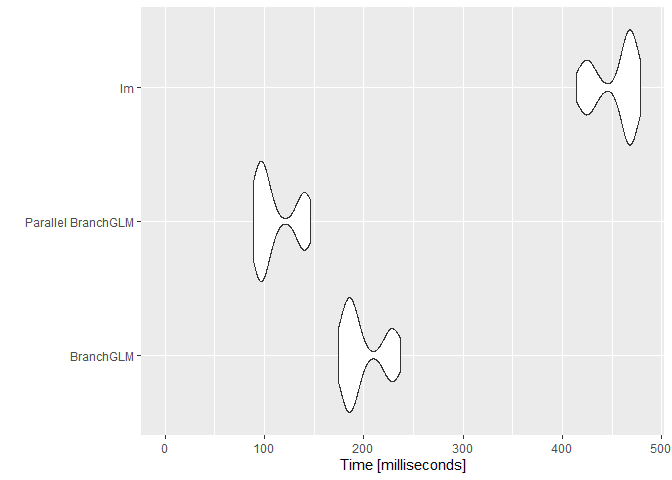

BranchGLM
================

# Overview

**BranchGLM** is a package for fitting GLMs and performing efficient
variable selection for GLMs.

# How to install

**BranchGLM** can be installed using the `install.packages()` function

``` r
install.packages("BranchGLM")
```

It can also be installed via the `install_github()` function from the
**devtools** package.

``` r
devtools::install_github("JacobSeedorff21/BranchGLM")
```

# Usage

## Fitting GLMs

### Linear regression

**BranchGLM** can fit large linear regression models very quickly, next
is a comparison of runtimes with the built-in `lm()` function. This
comparison is based upon a randomly generated linear regression model
with 10000 observations and 250 covariates.

``` r
# Loading libraries
library(BranchGLM)
library(microbenchmark)
library(ggplot2)

# Setting seed
set.seed(99601)

# Defining function to generate dataset for linear regression
NormalSimul <- function(n, d, Bprob = .5){
  
  x <- MASS::mvrnorm(n, mu = rep(1, d), Sigma = diag(.5, nrow = d, ncol = d) + 
                 matrix(.5, ncol = d, nrow = d))
  
  beta <- rnorm(d + 1, mean = 1, sd = 1) 
  
  beta[sample(2:length(beta), floor((length(beta) - 1) * Bprob))] = 0
  
  y <- x %*% beta[-1] + beta[1] + rnorm(n, sd = 3)
  
  df <- cbind(y, x) |> 
    as.data.frame()
  
  df$y <- df$V1
  
  df$V1 <- NULL
  
  df
}
# Generating linear regression dataset
df <- NormalSimul(10000, 250)

# Timing linear regression methods with microbenchmark
Times <- microbenchmark("BranchGLM" = {BranchGLM(y ~ ., data = df, 
                                                        family = "gaussian",
                                                   link = "identity")},
                        "Parallel BranchGLM" = {BranchGLM(y ~ ., data = df, 
                                                        family = "gaussian",
                                                   link = "identity",
                                                   parallel = TRUE)},
                        "lm" = {lm(y ~ ., data = df)},
                        times = 100)

# Plotting results
autoplot(Times, log = FALSE)
```

<!-- -->

### Logistic regression

**BranchGLM** can also fit large logistic regression models very
quickly, next is a comparison of runtimes with the built-in `glm()`
function. This comparison is based upon a randomly generated logistic
regression model with 10000 observations and 100 covariates.

``` r
# Setting seed
set.seed(78771)

# Defining function to generate dataset for logistic regression
LogisticSimul <- function(n, d, Bprob = .5, sd = 1, rho = 0.5){
  
  x <- MASS::mvrnorm(n, mu = rep(1, d), Sigma = diag(1 - rho, nrow = d, ncol = d) + 
                 matrix(rho, ncol = d, nrow = d))
  
  beta <- rnorm(d + 1, mean = 0, sd = sd) 
  
  beta[sample(2:length(beta), floor((length(beta) - 1) * Bprob))] = 0
  beta[beta != 0] <- beta[beta != 0] - mean(beta[beta != 0])
  
  p <- 1/(1 + exp(-x %*% beta[-1] - beta[1]))
  
  y <- rbinom(n, 1, p)
  
  df <- cbind(y, x) |> 
    as.data.frame()
  df
}

# Generating logistic regression dataset
df <- LogisticSimul(10000, 100)

# Timing logistic regression methods with microbenchmark
Times <- microbenchmark("BFGS" = {BranchGLM(y ~ ., data = df, family = "binomial",
                                                   link = "logit", method = "BFGS")}, 
                        "L-BFGS" = {BranchGLM(y ~ ., data = df, family = "binomial",
                                                   link = "logit", method = "LBFGS")},
                        "Fisher" = {BranchGLM(y ~ ., data = df, family = "binomial",
                                                   link = "logit", method = "Fisher")},
                        "Parallel BFGS" = {BranchGLM(y ~ ., data = df, family = "binomial",
                                                   link = "logit", method = "BFGS",
                                                   parallel = TRUE)}, 
                        "Parallel L-BFGS" = {BranchGLM(y ~ ., data = df, 
                                                       family = "binomial",
                                                   link = "logit", method = "LBFGS",
                                                   parallel = TRUE)},
                        "Parallel Fisher" = {BranchGLM(y ~ ., data = df, 
                                                        family = "binomial",
                                                   link = "logit", method = "Fisher",
                                                   parallel = TRUE)},
                        "glm" = {glm(y ~ ., data = df, family = "binomial")},
                        times = 100)

# Plotting results
autoplot(Times, log = FALSE)
```

<!-- -->

## Best subset selection

**BranchGLM** can also perform best subset selection very quickly, here
is a comparison of runtimes with the `bestglm()` function from the
**bestglm** package. This comparison is based upon a randomly generated
logistic regression model with 1000 observations and 15 covariates.

``` r
# Loading bestglm
library(bestglm)

# Setting seed and creating dataset
set.seed(33391)
df <- LogisticSimul(1000, 15, .5, sd = 0.5)

# Times
## Timing switch branch and bound
BranchTime <- system.time(BranchVS <- VariableSelection(y ~ ., data = df, 
                                      family = "binomial", link = "logit",
                  type = "switch branch and bound", showprogress = FALSE,
                  parallel = FALSE, method = "Fisher", 
                  bestmodels = 10, metric = "AIC"))

BranchTime
```

    ##    user  system elapsed 
    ##    0.17    0.00    0.16

``` r
## Timing exhaustive search
Xy <- cbind(df[,-1], df[,1])
ExhaustiveTime <- system.time(BestVS <- bestglm(Xy, family = binomial(), IC = "AIC", 
                                                TopModels = 10))
ExhaustiveTime
```

    ##    user  system elapsed 
    ##  100.66    0.44  101.30

Finding the top 10 logistic regression models according to AIC for this
simulated regression model with 15 variables with the switch branch and
bound algorithm is about 633.13 times faster than an exhaustive search.

### Checking results

``` r
# Results
## Checking if both methods give same results
BranchModels <- t(BranchVS$bestmodels[-1, ] == 1)
ExhaustiveModels <- as.matrix(BestVS$BestModels[, -16])
identical(BranchModels,  ExhaustiveModels)
```

    ## [1] TRUE

Hence the two methods result in the same top 10 models and the switch
branch and bound algorithm was much faster than an exhaustive search.

### Visualization

There is also a convenient way to visualize the top models with the
**BranchGLM** package.

``` r
# Plotting models
plot(BranchVS, type = "b")
```

<!-- --><!-- -->

## Backward elimination

**BranchGLM** can also perform backward elimination very quickly, here
is a comparison of runtimes with the `step()` function from the
**stats** package. This comparison is based upon a randomly generated
logistic regression model with 1000 observations and 50 covariates.

``` r
# Setting seed and creating dataset
set.seed(33391)
df <- LogisticSimul(1000, 50, .5, sd = 0.5)

# Times
## Timing BranchGLM
BackwardTime <- system.time(BackwardVS <- VariableSelection(y ~ ., data = df, 
                                      family = "binomial", link = "logit",
                  type = "backward", showprogress = FALSE,
                  parallel = FALSE, method = "LBFGS", 
                  metric = "AIC"))

BackwardTime
```

    ##    user  system elapsed 
    ##    2.82    0.04    2.89

``` r
## Timing step function
fullmodel <- glm(y ~ ., data = df, family = binomial(link = "logit"))
stepTime <- system.time(BackwardStep <- step(fullmodel, direction = "backward", trace = 0))
stepTime
```

    ##    user  system elapsed 
    ##    8.71    0.20    8.96

Using the backward elimination algorithm from the **BranchGLM** package
was about 3.1 times faster than step was for this logistic regression
model.

### Checking results

``` r
# Checking if both methods give same results
## Getting names of variables in final model from BranchGLM
BackwardCoef <- coef(BackwardVS)
BackwardCoef <- BackwardCoef[BackwardCoef != 0, ]
BackwardCoef <- BackwardCoef[order(names(BackwardCoef))]

## Getting names of variables in final model from step
BackwardCoefGLM <- coef(BackwardStep)
BackwardCoefGLM <- BackwardCoefGLM[order(names(BackwardCoefGLM))]
identical(names(BackwardCoef), names(BackwardCoefGLM))
```

    ## [1] TRUE

Hence the two methods result in the same best model and the backward
elimination algorithm from **BranchGLM** is much faster than step.

### Visualization

There is also a convenient way to visualize the backward elimination
path with the **BranchGLM** package.

``` r
# Plotting models
plot(BackwardVS, type = "b")
```

<!-- --><!-- -->
